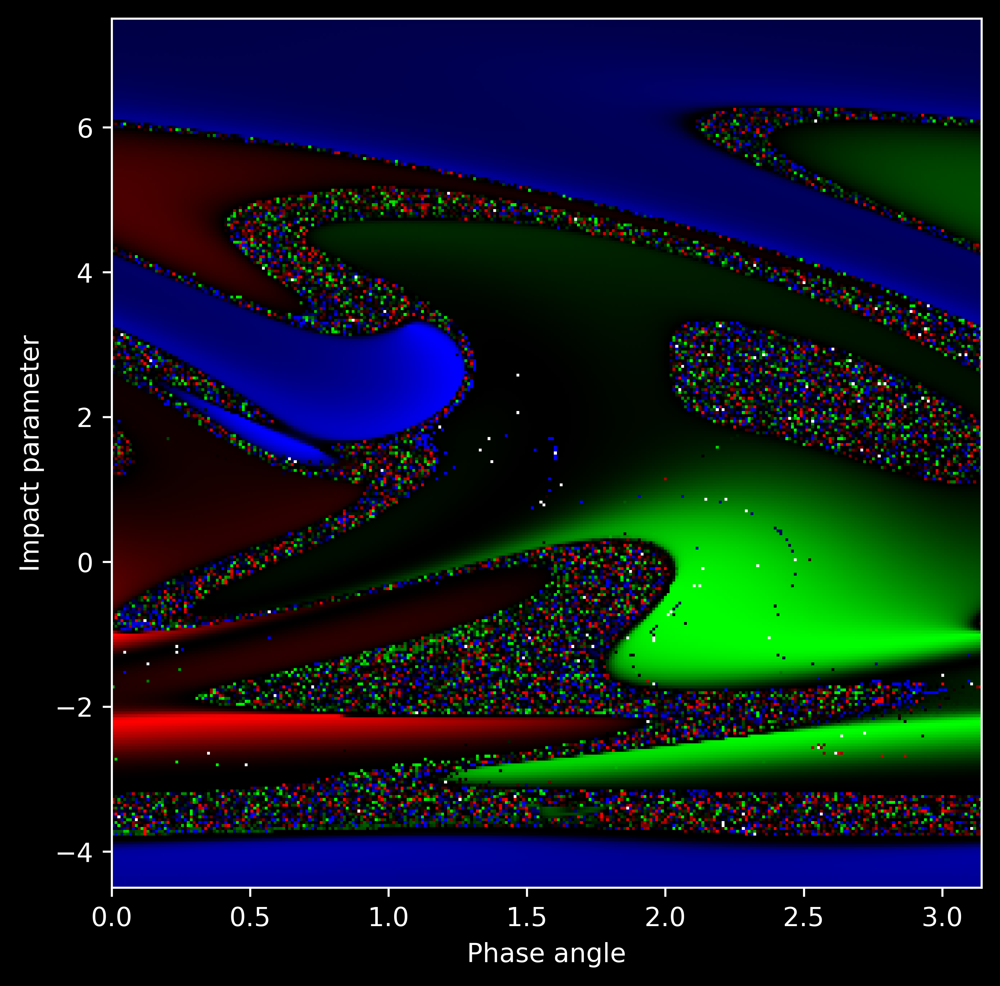

multi-gravity-simulation
========================

A tool for simulating multiple gravitational particle systems in parallel using
[OpenMP](https://www.openmp.org/), written in C++. Each system is initialized from an
[input file](#input-file-format) containing the particle's masses, initial positions and
velocities and produces a corresponding [output file](#output-file-format) containing
the particle states at different points in time.

1. [Example: 3-Body Fractal](#example-3-body-fractal)
2. [Installation](#installation)
3. [Usage](#usage)
    * [Input File Format](#input-file-format)
    * [Output File Format](#output-file-format)
    * [Unit Systems](#unit-systems)
    * [Integration Methods](#integration-methods)

Example: 3-Body Fractal
-----------------------
This fractal image is the product of 301×301 3-body simulations ran via this tool. Both
the input files and the visualization were generated using the provided
[Python scripts](scripts). For more background about this image, feel free to read the
explanation in [this 4-page PDF](docs/3body-fractal.pdf).



Installation
------------
1. Clone this repository:
    ```sh
    git clone https://github.com/jmittendo/multi-gravity-simulation
    ```
2. Build using [CMake](https://cmake.org/) and your desired generator (the build
directory must be directly inside the repository as the config file is expected to be at
`../config.txt` relative to the executable):
    ```sh
    cd multi-gravity-simulation
    cmake . -B <build-dir> -G <generator>
    ```
3. Compile using the generated makefile:
    ```sh
    cd <build-dir>
    # Windows: e.g. using MinGW
    mingw32-make
    # Linux:
    make
    ```
4. (Optional) To use the provided Python scripts:
    1. Install [Python 3.12](https://www.python.org/) or higher
    2. Enter the repo directory and create a virtual environment:
        ```sh
        python -m venv .venv
        ```
    3. Update pip if necessary and install the requirements:
        ```sh
        python -m pip install -U pip
        python -m pip install -r requirements.txt
        ```


Usage
-----
To use the tool, a copy of the provided `example-config.txt` named `config.txt` should
have been created inside the repo directory when running/configuring CMake (if not, just
create a copy yourself). Open the config file and set the `inputFilesDir` parameter in
the to a directory containing [input files](#input-file-format). Then, set the
`outputDir` parameter to the directory where you want the
[output files](#output-file-format) to be stored. Adjust the other parameters to your
needs (all of them are briefly explained inside the config itself). Run the executable
from inside the build directory so that the config file is directly one level above
your current working directory (i.e. at `../config.txt`).

### Input File Format
An input file must be a text file structured in the following way:
- The first line must
be a valid [unit system id](#unit-systems) string which matches the units used for the
particle data.
- Each following line describes the state of a particle using floats seperated by
whitespace for its mass, x-position, y-position, x-velocity, and y-velocity (in this
exact order).

Example:
```
solsys
1.0 0.5 0.0 0.0 4.4
4.0 -0.5 0.0 0.0 -4.4
3.0 50.0 -4.1 -4.4 0.02
```

### Output File Format
For each input file, a corresponding output text file with the file name
`<input-file-stem>_output.txt` is generated in the specified output directory. The data
is structured in the following way:
- Each line is a snapshot of the system at a given time in the simulation and consists
of floats seperated by a comma and a space (i.e. `, `).
- The first float is the simulation time of the snapshot.
- The following floats are the masses of all particles in order (of the input file).
- The following floats are the positions of all particles in order, layed out as
x<sub>1</sub>, y<sub>1</sub>, x<sub>2</sub>, y<sub>2</sub>, etc.
- The following floats are the velocities of all particles in order, layed out as
v<sub>x,1</sub>, v<sub>y,1</sub>, v<sub>x,2</sub>, v<sub>y,2</sub>, etc.
- The final float is the energy of the system in its current state.

The units of these numbers are the [unit system](#unit-systems) set for the simulation
in `config.txt`.

Example:
```
0, 1, 1, 1, 0.480147, 0.139496, -0.480147, -0.139496, 50, -3.07151, -1.23952, 4.26646, 1.23952, -4.26646, -4.41955, 0.01755, -11.549
0.506399, 1, 1, 1, 0.0373625, -0.498819, -0.0332118, 0.498561, 47.7578, -3.06236, 4.44049, 0.312974, -4.42384, -0.31402, -4.4362, 0.0185955, -11.5504
1.01271, 1, 1, 1, -0.486304, 0.0700839, 0.503437, -0.0711683, 45.5071, -3.05265, -0.610176, -4.40014, 0.645105, 4.3979, -4.45448, 0.0197941, -11.5518
1.51893, 1, 1, 1, 0.193498, 0.467503, -0.153662, -0.470066, 43.2471, -3.04229, -4.13937, 1.54092, 4.19447, -1.54455, -4.47466, 0.0211816, -11.5533
...
```

### Unit Systems
The following unit systems are available:

| Id        | Length Unit            | Mass Unit                    | Time Unit                                    |
| --------- | ---------------------- | ---------------------------- | -------------------------------------------- |
| si        | 1 m                    | 1 kg                         | 1 s                                          |
| cgs       | 1 cm                   | 1 g                          | 1 s                                          |
| solsys    | 1 au                   | 1 solar mass                 | 1 year                                       |
| galactic  | 1 kpc                  | 10<sup>10</sup> solar masses | 10<sup>9</sup> years                         |
| earthmoon | 3.844*10<sup>8</sup> m | 1 Earth mass                 | 1 day                                        |
| fff       | 201.168 m              | 40.8233133 kg                | 1.2096*10<sup>6</sup> s                      |
| G1        | 1 au                   | 1 solar mass                 | sqrt(1 au<sup>3</sup> / 1 solar mass / G)    |

### Integration Methods
The following integration methods are available:

| Id    | Full Name                             |
| ----- | ------------------------------------- |
| kdk   | Kick-Drift-Kick (Leapfrog algorithm)  |
| dkd   | Drift-Kick-Drift (Leapfrog algorithm) |
| euler | Euler method                          |
| rk4   | 4th order Runge-Kutta method          |
